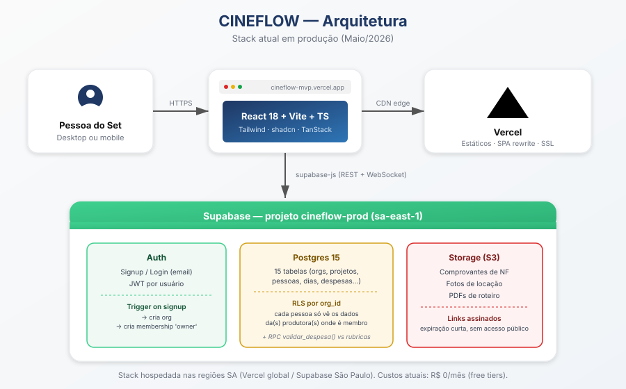

# CINEFLOW — Setup do MVP via Claude (passo a passo real)

> Este documento descreve o fluxo de implementação que efetivamente foi executado entre o Thiago e o Claude (via Cowork) para colocar o CINEFLOW no ar. Ele substitui versões anteriores que assumiam uso do Lovable.dev — o caminho final foi diferente: código gerado direto, Supabase + Vercel CLI, sem repositório GitHub.

---

## URLs e dados de referência

| Item | Valor |
|---|---|
| App público | https://cineflow-mvp.vercel.app |
| Projeto Supabase | https://supabase.com/dashboard/project/dsrulpipsksvtskqwevc |
| Project ID Supabase | `dsrulpipsksvtskqwevc` |
| Pasta local do código | `C:\Users\Thiago França\Documents\Claude\Projects\Cineflow\cineflow-mvp` |
| Variável SUPABASE_URL | `https://dsrulpipsksvtskqwevc.supabase.co` |
| Variável SUPABASE_ANON_KEY (publishable) | `sb_publishable_VOiuSW3i8Bs2sp33_7dqCQ_wSLJOPva` |
| Dashboard Vercel | https://vercel.com/cineflow-s-projects/cineflow-mvp |

---

## Visão de arquitetura



**Como os pedaços conversam, em uma frase:**

A pessoa do set abre `cineflow-mvp.vercel.app` no navegador → o React (servido como arquivos estáticos pela Vercel) chama o Supabase (Auth + Postgres + Storage) em São Paulo via `supabase-js` → o Postgres aplica RLS (Row-Level Security) por `org_id` em cada query, garantindo que só os dados da(s) produtora(s) onde a pessoa é membro chegam ao cliente.

**Três detalhes que fazem o sistema funcionar:**

1. **Trigger no signup** cria uma org automaticamente para cada novo usuário e o vincula como `owner`. Por isso o convite manual (Fase 7) "adota" a pessoa numa org existente em vez de criar do zero.
2. **Função RPC `validar_despesa()`** roda no banco toda vez que uma despesa é inserida ou atualizada — cruza com as rubricas do edital vinculado ao projeto e grava resultado em `validacoes_edital` (`ok`/`warn`/`fail`).
3. **`vercel.json` com rewrite `/(.*) → /index.html`** faz o roteamento SPA funcionar (sem isso, qualquer URL interna ou refresh dá 404).

---

## Fase 0 — Pré-requisitos

- Computador com Windows 10/11
- Chrome ou Edge com extensão **Claude in Chrome** instalada (claude.com/chrome)
- Conta Google ou e-mail próprio
- Acesso a uma sessão Cowork com o Claude

Nada mais precisa estar pré-instalado — Node.js e Vercel CLI são instalados no processo.

---

## Fase 1 — Código (~5 min, feito pelo Claude)

O Claude gerou 51 arquivos de código TypeScript/React + 1 migration SQL completa direto na pasta `cineflow-mvp/`. Stack:

- React 18 + Vite + TypeScript
- Tailwind CSS + shadcn/ui (componentes inline)
- Supabase JS client + TanStack Query + React Router
- Zustand (estado UI), react-hook-form + zod (formulários), sonner (toasts)

O esquema de banco cobre 15 tabelas (orgs, projetos, pessoas, locações, dias de filmagem, escalas, ordens do dia, orçamentos, despesas, validações, editais, rubricas etc.) com RLS habilitada por organização e seed de 2 editais (Funcultura PE + Lei Paulo Gustavo) com 14 rubricas.

**Validação local:** o build TypeScript + Vite passou com zero erros no sandbox antes de qualquer publicação.

---

## Fase 2 — Banco (Supabase)

### 2.1 Criar projeto
1. `supabase.com/dashboard` → **New project**
2. Nome: `cineflow-prod`
3. Região: **South America (São Paulo)** — sempre, pra menor latência
4. Plano: **Free**
5. Gerar senha do banco e salvar em gerenciador de senhas

### 2.2 Pegar URL + Publishable Key
1. **Settings → API Keys**
2. Copiar:
   - Project URL: `https://dsrulpipsksvtskqwevc.supabase.co`
   - **Publishable key**: `sb_publishable_...` (sistema novo do Supabase; substitui a `anon` legacy)
3. Nunca copiar a `secret key` para o frontend

### 2.3 Rodar migration
1. **SQL Editor → New query**
2. Abrir local: `cineflow-mvp/supabase/migrations/0001_init.sql`
3. Copiar o conteúdo inteiro pro clipboard. **Truque infalível** (evita confusão de clipboard):
   ```powershell
   Get-Content "C:\Users\Thiago França\Documents\Claude\Projects\Cineflow\cineflow-mvp\supabase\migrations\0001_init.sql" -Encoding UTF8 -Raw | Set-Clipboard
   ```
4. Colar no SQL Editor → **Run**
5. Esperado: "Success. No rows returned" e múltiplas mensagens verdes de criação

### 2.4 Configurar Auth
**URL Configuration:**
- **Site URL:** `https://cineflow-mvp.vercel.app`
- **Redirect URLs:**
  - `https://cineflow-mvp.vercel.app/**`
  - `http://localhost:5173/**`

**Providers → Email:**
- Desligar **Confirm email** (para piloto). Religar quando for produção real.

---

## Fase 3 — Node.js + Vercel CLI

### 3.1 Instalar Node.js (LTS)
```powershell
winget install OpenJS.NodeJS.LTS
```
Fechar e reabrir o PowerShell. Conferir:
```powershell
node --version    # v20.x ou superior
npm --version
```

### 3.2 Permitir scripts no PowerShell
Por padrão, Windows bloqueia scripts `.ps1` (que é o formato do `npm.cmd`). Liberar só para o usuário atual:
```powershell
Set-ExecutionPolicy -ExecutionPolicy RemoteSigned -Scope CurrentUser
```
Confirmar com `S`.

### 3.3 Instalar Vercel CLI
```powershell
npm install -g vercel
vercel --version
```

---

## Fase 4 — Setup local

```powershell
cd "C:\Users\Thiago França\Documents\Claude\Projects\Cineflow\cineflow-mvp"
notepad .env
```

Conteúdo do `.env`:
```
VITE_SUPABASE_URL=https://dsrulpipsksvtskqwevc.supabase.co
VITE_SUPABASE_ANON_KEY=sb_publishable_VOiuSW3i8Bs2sp33_7dqCQ_wSLJOPva
```

Instalar dependências e rodar local:
```powershell
npm install
npm run dev
```

Acessar `http://localhost:5173/` no navegador. Deve aparecer a tela de login do CINEFLOW.

> ⚠️ **Se der erro `Cannot find module @rollup/rollup-win32-x64-msvc`** ao rodar `npm run dev`: bug conhecido do npm com optional dependencies. Solução:
> ```powershell
> Remove-Item -Recurse -Force node_modules, package-lock.json -ErrorAction SilentlyContinue
> npm install
> npm run dev
> ```

---

## Fase 5 — Deploy no Vercel

### 5.1 Login
```powershell
vercel login
```
Escolher Continue with GitHub (ou e-mail). Autorizar no navegador.

### 5.2 Primeiro deploy
```powershell
cd "C:\Users\Thiago França\Documents\Claude\Projects\Cineflow\cineflow-mvp"
vercel
```
Respostas:
- Set up and deploy → **Y**
- Which scope → seu time pessoal
- Link to existing project → **N**
- Project name → **cineflow-mvp** (ou Enter)
- Code directory → **./** (Enter)
- Customize settings → **N**

Gera URL temporária. Não funciona ainda — faltam variáveis de ambiente.

### 5.3 Configurar variáveis de ambiente
Repetir 6 vezes (2 variáveis × 3 ambientes):
```powershell
vercel env add VITE_SUPABASE_URL production
vercel env add VITE_SUPABASE_ANON_KEY production
vercel env add VITE_SUPABASE_URL preview
vercel env add VITE_SUPABASE_ANON_KEY preview
vercel env add VITE_SUPABASE_URL development
vercel env add VITE_SUPABASE_ANON_KEY development
```

Para cada uma:
- Cole o valor correspondente (`https://...supabase.co` ou `sb_publishable_...`)
- "Make it sensitive?" → **Y**
- "How to proceed?" → **Leave as is** (manter o prefixo `VITE_` — sem ele o Vite não expõe ao frontend)
- Em preview: "Add to which Git branch?" → **Enter** (em branco = todas)

### 5.4 Re-deploy para produção
```powershell
vercel --prod
```

Resulta em:
- URL longa: `https://cineflow-xxxxx-cineflow-s-projects.vercel.app`
- **URL limpa (use essa para compartilhar):** `https://cineflow-mvp.vercel.app`

### 5.5 Configurar SPA routing (importante!)
Sem isso, qualquer link compartilhado ou refresh em página interna dá **404 NOT_FOUND**. Arquivo `vercel.json` na raiz do projeto:

```json
{
  "$schema": "https://openapi.vercel.sh/vercel.json",
  "rewrites": [
    { "source": "/(.*)", "destination": "/index.html" }
  ]
}
```

Depois: `vercel --prod` novamente.

---

## Fase 6 — Manutenção (publicar mudanças)

O deploy **não é automático** porque não conectamos repo GitHub. Sempre que o código mudar:

```powershell
cd "C:\Users\Thiago França\Documents\Claude\Projects\Cineflow\cineflow-mvp"
vercel --prod
```

Leva ~30 segundos. Atalho mental: **toda vez que o Claude editar arquivos em `cineflow-mvp/`, rodar `vercel --prod`**. O Claude foi treinado pra te lembrar disso sempre que fizer mudança.

---

## Fase 7 — Adicionar pessoa à sua produtora

O app não tem fluxo de convite UI (fica pra V2). Por enquanto, manual via SQL:

### Passo 1: a pessoa cria a conta
Mandar pra ela: `https://cineflow-mvp.vercel.app/signup`. Ela preenche nome, nome de produtora qualquer (vai ser ignorada), e-mail, senha.

### Passo 2: rodar SQL no Supabase
Abrir **SQL Editor → New query** e colar (substituindo os valores):

```sql
-- Substitua os 3 valores abaixo:
--   :email_convidado  = e-mail que a pessoa usou no signup
--   :email_owner      = SEU e-mail (do dono da produtora)
--   :papel            = owner | admin_financeiro | diretor_producao | diretor | ad | chefe_departamento | equipe

with conv as (
  select id from auth.users where email = 'EMAIL_CONVIDADO_AQUI' limit 1
), owner_org as (
  select m.org_id
  from public.memberships m
  join auth.users u on u.id = m.user_id
  where u.email = 'SEU_EMAIL_AQUI' and m.papel = 'owner'
  limit 1
)
insert into public.memberships (org_id, user_id, papel, ativo)
select owner_org.org_id, conv.id, 'PAPEL_AQUI', true
from conv, owner_org
on conflict (org_id, user_id) do update set papel = excluded.papel, ativo = true;
```

Depois: a pessoa faz logout e login de novo no app. Vai ver a sua produtora.

### Papéis disponíveis e nível de acesso

| Papel | Acesso |
|---|---|
| `owner` | Tudo (igual a você) |
| `admin_financeiro` | Lê tudo, edita só financeiro e prestação |
| `diretor_producao` | Cronograma, OD, equipe, locações; lê financeiro |
| `diretor` | Roteiro/decupagem; lê o resto |
| `ad` | Cronograma, OD, check-in |
| `chefe_departamento` | Só a área dele (você define em `departamento`) |
| `equipe` | Lê o que lhe diz respeito |

---

## Fase 8 — Custos atuais

| Serviço | Plano atual | Custo |
|---|---|---|
| Supabase | Free | R$ 0 |
| Vercel | Hobby | R$ 0 |
| Domínio (opcional) | `.vercel.app` automático | R$ 0 |
| **Total** | | **R$ 0/mês** |

Ao crescer:
- Mais de 500 MB de banco ou 5 GB de tráfego → Supabase Pro (~R$ 125/mês)
- Mais de 100 GB de banda de saída → Vercel Pro (~R$ 100/mês)

Break-even continua em **5–10 clientes pagantes** no plano LTDA (R$ 199/mês).

---

## Fase 9 — Recursos planejados para próximas sprints

Já no roadmap, **fora do MVP atual:**

- OCR de NF (foto → Mindee + classificação Claude → preenche financeiro)
- Check-in com GPS
- Push-to-Talk via LiveKit
- Importação de roteiro PDF + decupagem automática
- Stripboard drag-and-drop
- Mais editais no catálogo (Ancine/FSA, Spcine, BRDE, LPG estaduais)
- Mobile nativo via Capacitor
- Integração contábil (Domínio, Contabilizei)

---

## Fase 10 — Em caso de problema

| Sintoma | Causa provável | Correção |
|---|---|---|
| `npm: termo não reconhecido` | Node não instalado ou PowerShell não recarregou PATH | Instalar via winget + fechar/reabrir PS |
| `não pode ser carregado... execução de scripts foi desabilitada` | ExecutionPolicy do Windows | `Set-ExecutionPolicy RemoteSigned -Scope CurrentUser` |
| `Cannot find module @rollup/rollup-win32-x64-msvc` | Bug conhecido npm | Apagar `node_modules` + `package-lock.json` e `npm install` |
| `404 NOT_FOUND` em página interna do app público | Falta `vercel.json` | Criar `vercel.json` com rewrite + `vercel --prod` |
| Login funciona mas redireciona pra localhost | Site URL no Supabase está como `localhost` | Auth → URL Configuration → trocar para URL Vercel |
| Sidebar não aparece em mobile | Comportamento esperado: usar hambúrguer ⌘ no topo | — |

Em qualquer outro erro: cole no chat com o Claude que ele corrige.

---

## Glossário

Termos que aparecem no app e neste documento, definidos sem jargão:

| Termo | O que é | Onde aparece |
|---|---|---|
| **Ordem do Dia (OD)** | Documento diário que diz para cada pessoa da equipe e do elenco onde estar, em que horário, fazendo o quê. Equivalente brasileiro do "call sheet" americano. | Módulo "Ordem do Dia" |
| **Decupagem técnica** | Quebra do roteiro em planos e elementos por cena (atores, figurino, arte, efeitos, etc.) | Roadmap (próxima sprint) |
| **Stripboard** | Visualização do cronograma como tarjetas (uma por cena) arrastáveis por dia. Usada para otimizar agrupamento por locação e elenco. | Roadmap (próxima sprint) |
| **DOOD** | "Day Out of Days" — relatório de em quais dias cada pessoa do elenco está escalada. Útil para contratação por diária. | Roadmap |
| **Rubrica** | Categoria de despesa dentro do orçamento de um edital (ex.: EQUIPE, ELENCO, EQUIP, POS, ADM). Cada rubrica tem um % máximo do orçamento total que pode consumir. | Módulo Financeiro |
| **Edital** | Programa de fomento (Funcultura, Lei Paulo Gustavo, Ancine/FSA, Spcine, BRDE etc.) com regras próprias de elegibilidade de despesas, % máximos por rubrica, prazos, documentos obrigatórios. | Cadastro de projeto + Prestação |
| **Prestação de contas** | Relatório obrigatório de como o dinheiro do edital foi gasto, com notas fiscais organizadas por rubrica. Erros aqui geram **glosa** (perda de reembolso). | Módulo Prestação |
| **Glosa** | Quando o concedente do edital recusa uma despesa na prestação de contas (a produtora "come o prejuízo"). O CINEFLOW evita isso validando despesas em tempo real. | Risco que o produto resolve |
| **Validação** | Resultado automático rodado pelo Supabase para cada despesa nova: `ok` (verde), `warn` (amarelo, atenção), `fail` (vermelho, bloqueia). | Coluna "Validação" no Financeiro |
| **RLS** | "Row-Level Security" — recurso do Postgres que filtra automaticamente quais linhas cada usuário pode ler/escrever. No CINEFLOW, garante que ninguém vê dados de outra produtora. | Banco de dados |
| **Org / Produtora** | A entidade-mãe no banco. Cada produtora tem seus projetos, pessoas, locações, etc. Um mesmo usuário pode ser membro de múltiplas orgs com papéis diferentes. | Todo o app |
| **Membership** | A relação usuário × org com um papel (`owner`, `ad`, `diretor_producao` etc.). Define o que a pessoa pode fazer. | Tabela `memberships` |
| **Publishable key** | Chave do Supabase desenhada para ir embutida no frontend. É segura porque a RLS impede acesso indevido aos dados. Substituiu a antiga `anon key`. | `.env` + variáveis Vercel |
| **PWA** | "Progressive Web App" — uma página web que se comporta como app (instalável, funciona meio-offline, push notifications). O CINEFLOW já é PWA-ready. | Mobile (futuro) |
| **Edge Function** | Função TypeScript/Deno rodada pelo Supabase próxima do usuário. Usada para integrações que não devem ficar no cliente (OCR, IA, webhooks). | Roadmap |
| **OCR** | "Optical Character Recognition" — leitura automática de texto em imagem. Usado para extrair valor, CNPJ, número de uma foto de NF. | Roadmap (Mindee) |

---

## Autor & manutenção

Documento gerado pelo Claude (Anthropic) em sessão Cowork com **Thiago França** durante o programa de pré-incubação do **Porto Digital — Eixo Audiovisual**. Atualize este arquivo sempre que o fluxo mudar.

Última atualização: 22 de maio de 2026.
